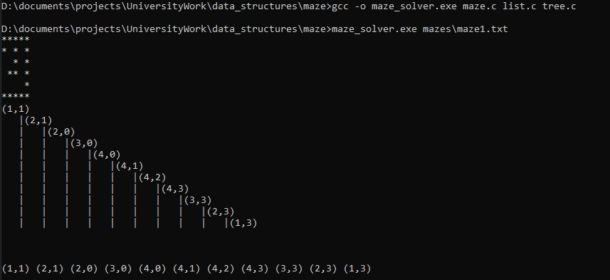
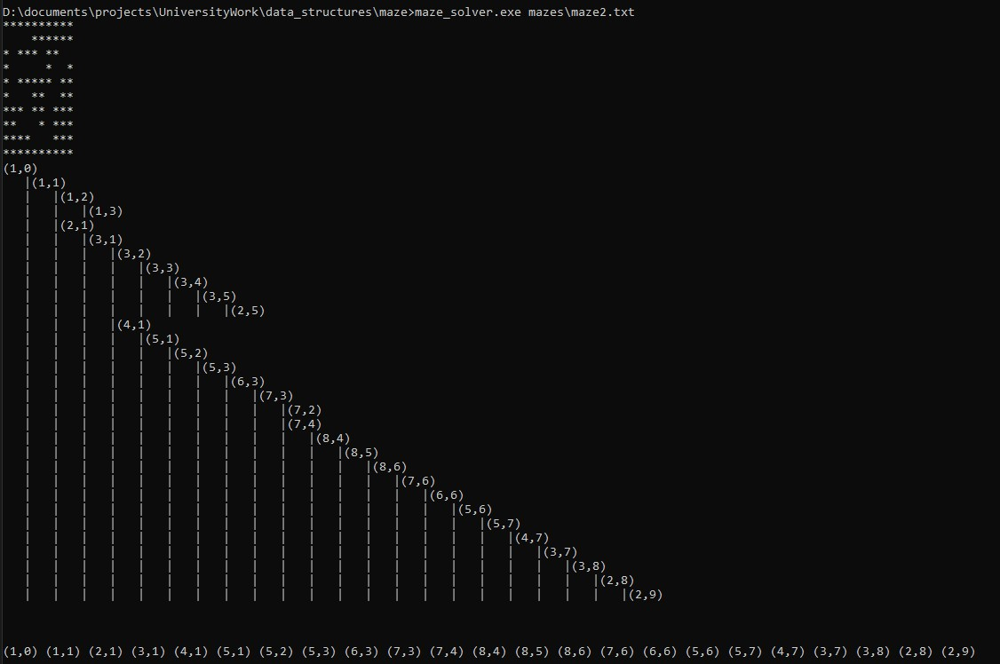

# Maze Solver

## Exercise Pronunciation

Write a program that solves labyrinths. The program should:

- Read a maze from a file.
- Print the maze.
- Find all paths and save them to a tree structure.
- Find all paths that lead to the exit and print them.

Standards:

- All arrays should be dynamically allocated.
- No global variables.
- The name of the input file (puzzle) will be given with command line arguments.
- Any data structure used must be implemented by the student in a different file.

## Screenshots

Maze1

Maze2

